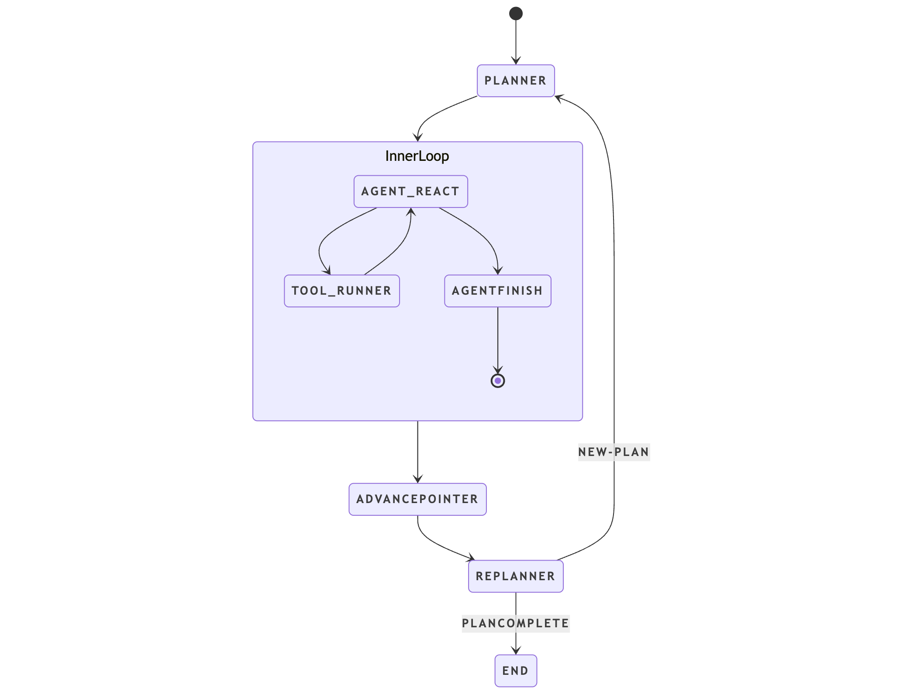

# Katalyst Agent

A modular, node-based terminal coding agent for Python, designed for robust, extensible, and production-ready workflows.


*Figure: Demo showing how to install and use Katalyst from the terminal*


*Figure: Architecture diagram of the Katalyst Coding Agent (DAG/graph structure)*

## Quick Setup

To install Katalyst from PyPI, simply run:

```bash
pip install katalyst
```

**1. Copy the example environment file:**

```bash
cp .env.example .env
```

**2.** You must set your OpenAI API key as the environment variable `OPENAI_API_KEY` or add it to a `.env` file in your project directory.

## Searching Files (ripgrep required)

The `search_files` tool requires [ripgrep](https://github.com/BurntSushi/ripgrep) (`rg`) to be installed on your system:
- **macOS:**   `brew install ripgrep`
- **Ubuntu:**  `sudo apt-get install ripgrep`
- **Windows:** `choco install ripgrep`

## Features

- Automatic conversation persistence: Katalyst saves your conversation history to a SQLite database in `.katalyst/checkpoints.db`, allowing you to resume conversations across sessions. Use `/new` to start fresh. 

- Modular Node-Based Architecture: Built on a robust DAG (Directed Acyclic Graph) structure that enables flexible and extensible workflows. The system uses a two-level agent structure with an outer planning loop and inner ReAct (Reason-Act) cycles.

- Intelligent Task Planning: Automatically breaks down complex tasks into manageable sub-tasks and executes them sequentially with built-in error recovery and replanning capabilities.

- Human-in-the-Loop Verification: Interactive plan approval system that allows users to:
  - Review generated plans before execution
  - Provide feedback for better plans
  - Automatically approve plans with `--auto-approve` flag
  - Iterate on plans until they meet requirements

- Rich Tool Integration: Comprehensive set of built-in tools for:
  - File operations (reading, writing, searching)
  - Code analysis and syntax checking
  - Terminal command execution
  - And more, with easy extensibility for custom tools

- Robust Error Handling: Sophisticated error recovery system that can:
  - Classify and format errors for better LLM understanding
  - Automatically trigger replanning when needed
  - Maintain detailed error traces for debugging

- Multi-Language Support: Built-in support for multiple programming languages including:
  - Python
  - JavaScript/TypeScript
  - JSX/TSX
  - (More languages will be added soon...)

- Interactive CLI: User-friendly command-line interface with:
  - Helpful welcome screens and onboarding
  - Real-time feedback and progress updates
  - Detailed logging for debugging

- Configurable LLM Integration: Flexible LLM provider support with:
  - Default OpenAI integration
  - Configurable model selection
  - Easy extension for other LLM providers

## Observability & Tracing (Phoenix)

Katalyst can emit OpenTelemetry traces (via OpenInference) to Phoenix for rich observability.

### 1) Start Phoenix (Docker)

```bash
docker compose up -d phoenix
```

Phoenix UI will be available at [Phoenix UI](http://localhost:6006).

### 2) Configure environment

Add the following to your `.env` (or export them in your shell):

```bash
# Enable Phoenix tracing
OTEL_PLATFORM=phoenix

# If running Phoenix locally on your host
OTEL_EXPORTER_OTLP_ENDPOINT=http://localhost:6006/v1/traces

# Any non-empty value is required by the exporter in this project
PHOENIX_API_KEY=dev
```

Notes:
- If you are sending traces from a container in the same Docker network as `phoenix`, you may use `http://phoenix:6006/v1/traces` as the endpoint.
- Invocation parameters are hidden by default for privacy (configured via OpenInference).

### 3) Run Katalyst

Use the CLI as usual. Traces will stream to Phoenix automatically on startup.

```bash
katalyst "Your task description"
```

Then open the Phoenix UI to explore spans, latency, tokens, and tool activity.

## Testing

Katalyst includes both unit and functional tests. For detailed information about running tests, writing new tests, and test coverage, see [TESTS.md](TESTS.md).


## TODO

See [TODO.md](./TODO.md) for the latest development tasks and roadmap.

